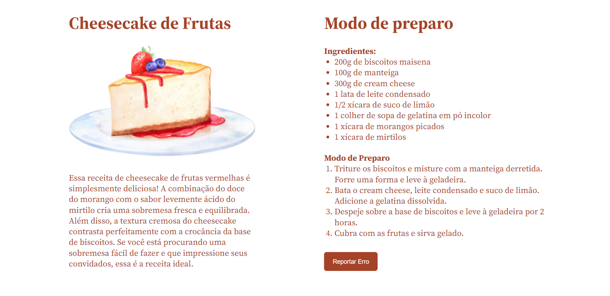

# Receita de Cheesecake
Uma receita simples de Cheesecake, porém esse projeto trabalha bastante a responsividade, se adaptando a diferentes tamanhos de telas.

## 🛠 Habilidades
- Javascript 
- HTML
- CSS

## 🔗 Links

## Demonstração

